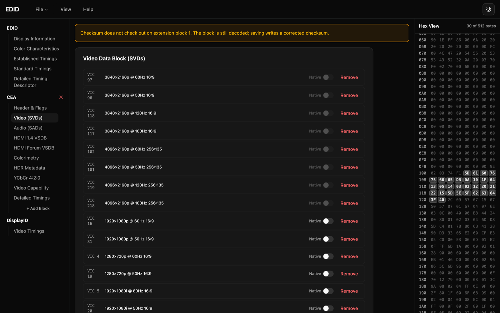
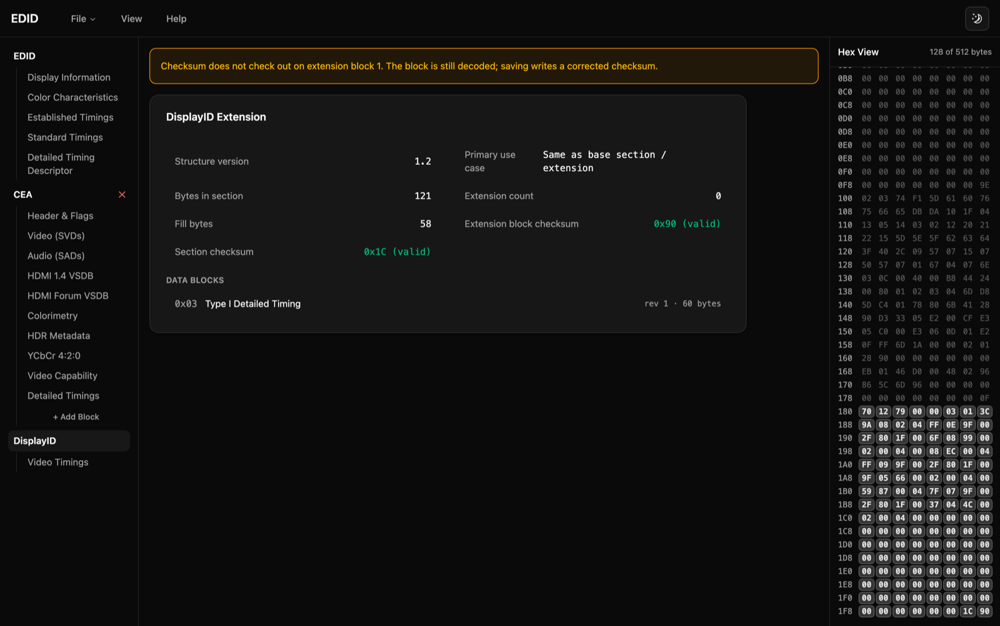

# edid-editor

A client-side viewer and editor for EDID — the block of bytes a monitor hands
the computer to describe itself: who made it, how big it is, and every video
mode it will accept. It decodes the base block, CEA-861 extensions and
DisplayID extensions down to individual bit fields, shows the bytes each field
occupies, and lets you change most of them and save the result.

Everything runs in the browser; nothing is uploaded. The desktop build adds one
thing the browser cannot do: reading the EDID straight off a monitor that is
plugged in.

> This repository is a fork of [thyge/edid-editor](https://github.com/thyge/edid-editor)
> (MIT), which is where the Vue app and the `edidts` package come from — its history and
> copyright are intact, see [LICENSE](LICENSE). Added here: a Tauri desktop build that
> reads EDIDs off attached monitors (`src-tauri/`), and DisplayID extension block parsing.
>
> The project is a continuation of [goedid](https://github.com/thyge/goedid).

## Demo

Every panel is backed by the raw bytes, and the hex view on the right
highlights whichever ones the open panel describes.



Above is a real LG panel. Two of its video codes — `DB` and `DA` — are in the
8-bit range CTA-861-G added for the 8K and Cinema 4K formats, so they decode to
4096×2160 at 120 and 100 Hz rather than to a low code with a "native" flag. The
amber banner is the editor reporting that this panel ships an extension block
whose checksum does not add up; the block is still decoded, and saving writes a
correct one.

DisplayID extensions are decoded too, including the v1.x structure that a lot of
shipping monitors actually use:



## What it does

- **Reads** the base 128-byte block, CEA-861 extension blocks, and DisplayID
  extension blocks (both Structure v2.x and the v1.x tag space).
- **Edits** most of the base block and the CEA extension — display parameters,
  established and standard timings, detailed timing descriptors, and the CEA
  data blocks — recomputing checksums as you go.
- **Shows the bytes.** Selecting a panel highlights the range it covers, so a
  field and its encoding are visible at once.
- **Flags what is wrong** rather than hiding it: a bad checksum on any block, or
  an extension count that nothing explains.
- **Reads attached monitors** in the desktop build (macOS, Windows; the Linux
  path is written but untested).

Decoding follows the published specifications rather than convention, and the
parser is tested against real monitor dumps: the byte layouts are commented with
the section and table numbers they come from, and encoding a decoded EDID has to
reproduce the original bytes exactly.

All of the decoding and encoding lives in [`packages/edidts`](packages/edidts),
which is framework-free and usable on its own; the Vue app only renders it.

## Goals

- Visualise EDID, CEA and DisplayID accurately enough to trust for debugging
  real hardware, not just to render something plausible.
- Edit the parts of an EDID that are worth editing, without silently rewriting
  the parts that are not being edited.

### Not done yet

- **DisplayID is read-only.** The encoders exist and round-trip, so the model
  supports editing; the UI does not expose it.
- **The CVT generator is not wired up.** `packages/edidts` can generate CVT
  timings (`calculateCVTTiming`, `generateCVTDetailedTiming`), but nothing in
  the app calls them — adding a detailed timing still means entering the
  numbers.
- **DisplayID v1.x is only partly decoded.** The Type I detailed timing block is
  read field by field; the other legacy tags keep their raw payload, because the
  v1.3 specification is not available here and guessing a layout would be worse
  than showing bytes.

## Building

This is an npm-workspaces monorepo: the root is the Vue app, and
`packages/edidts` is a separate library package that the app depends on
via `"edidts": "workspace:*"`. The app additionally has a Tauri shell in
`src-tauri/` that wraps the same Vue frontend into a native desktop app.
So "building the app" can mean three different things depending on what
you want out of it — a browser build, a desktop build, or just running
it locally. All three are covered below.

### 0. Prerequisites

* **Node.js** and **npm** (developed against Node 22; npm workspaces
  require npm 7+).
* **Rust + Cargo** — only needed for the desktop (Tauri) build, not for
  the plain web build. Check with `rustc --version` / `cargo --version`;
  install via [rustup](https://rustup.rs) if missing. `src-tauri/Cargo.toml`
  declares `rust-version = "1.77.2"` as the floor.
* **Tauri's native prerequisites** — again, desktop build only. These are
  OS-specific system packages (Xcode Command Line Tools on macOS, the
  WebView2 runtime on Windows — usually already present on Windows 10/11,
  and `webkit2gtk`/build tooling on Linux). Follow the official
  [Tauri prerequisites guide](https://v2.tauri.app/start/prerequisites/)
  for your OS rather than guessing package names here.

Install all workspace dependencies once from the repo root:

```bash
npm install
```

### 1. Build the `edidts` library first

`packages/edidts/dist` is **not committed to git** (see `.gitignore`:
`packages/*/dist`) and there is no `postinstall`/`prepare` hook that
builds it automatically. Because the app imports `edidts` by package name
(not by a relative/`src` path), Vite and `vue-tsc` resolve it through
`packages/edidts/package.json`'s `main`/`module`/`types` fields, which all
point into `dist/`. **On a fresh clone, `dist/` doesn't exist yet — build
it before touching the app:**

```bash
cd packages/edidts
npm run build      # tsc && vite build -> packages/edidts/dist/
cd ..
```

Equivalently, from the repo root: `npm run build --workspace=edidts`.

> **If you ever see confusing TypeScript errors** in app files that don't
> look related to your change (implicit-`any` on values whose type comes
> from an `edidts` import, or a type suddenly showing as `unknown`), the
> most likely cause is a **stale or partial `packages/edidts/dist`** —
> e.g. left over from an interrupted build. `vite-plugin-dts` emits one
> `.d.ts` file per source file plus a bundled `index.d.ts`; if a rebuild
> got interrupted, `index.d.ts` can end up referencing sibling `.d.ts`
> files that were never (re)written, which degrades those imported types
> silently instead of failing loudly. Fix: `rm -rf packages/edidts/dist`
> and rebuild it with the command above, then retry.

### 2. Build the Vue app (web)

From the repo root:

```bash
npm run build
```

This runs `vue-tsc -b && vite build`:
* `vue-tsc -b` type-checks the whole project in TypeScript's *build*
  (composite/project-references) mode. This is **not** the same as
  running `vue-tsc --noEmit` directly — the root `tsconfig.json` has an
  empty `files: []` and only lists `references`, so a plain `--noEmit`
  invocation at the root silently checks nothing. Use `vue-tsc -b`
  (or just `npm run build`, which always does) to actually type-check
  the app.
* `vite build` bundles the app into static files at **`dist/`**
  (HTML/CSS/JS, no server needed) — this is the same `dist/` referenced
  by `src-tauri/tauri.conf.json`'s `frontendDist`, which is how the
  desktop build gets its frontend.

Other useful root scripts:

```bash
npm run dev       # Vite dev server at http://localhost:5173, with HMR
npm run preview   # serve the dist/ output produced by `npm run build`, for a quick sanity check
npm run test      # vitest run — the edidts encode/decode unit tests (packages/edidts/tests)
```

`npm run dev` only needs step 0 + `npm install` + a built `edidts`
(step 1) — it does not require Rust/Tauri at all, since it's just the
browser-facing Vue app.

### 3. Build the desktop app (Tauri)

The desktop shell reuses the exact same Vue frontend — `tauri.conf.json`'s
`beforeBuildCommand`/`beforeDevCommand` call `npm run build`/`npm run dev`
for you, so you don't need to build the frontend by hand first (steps 1–2
still need to have been done at least once so the workspace and its
dependencies exist, but the Tauri CLI re-runs the frontend build itself
as part of its own build).

```bash
npm run tauri dev     # launches a real native window, hot-reloading the Vue frontend inside it
npm run tauri build   # produces a release build + installer/bundle for your current OS
```

`npm run tauri build` compiles the Rust backend (`src-tauri/`) in release
mode, then bundles it with the built frontend into a native package. On
this machine (macOS), that produces:

```
src-tauri/target/release/app                              # the raw executable
src-tauri/target/release/bundle/macos/EDID Editor.app      # the .app bundle
src-tauri/target/release/bundle/dmg/EDID Editor_<version>_<arch>.dmg   # a distributable disk image
```

The equivalent on Windows would be an `.exe`/`.msi`/NSIS installer under
`src-tauri/target/release/bundle/`, and on Linux a `.deb`/AppImage —
`tauri.conf.json` sets `bundle.targets: "all"`, so whatever bundle
formats make sense for the OS you're building *on* all get produced.

**Tauri builds for the platform and architecture you build it on** — it
does not cross-compile by default. Building a Windows `.exe` requires
building on (or targeting) Windows; you can't reliably produce one from
macOS without a Windows VM/machine or CI (e.g. a GitHub Actions job using
a `windows-latest` runner). The same applies in the other direction.

### 4. Releasing (GitHub Actions)

`.github/workflows/release.yml` does the cross-platform build for you. It
runs on `macos-latest` and `windows-latest` in parallel and produces:

* a **universal** macOS `.dmg` (Intel + Apple Silicon, via
  `--target universal-apple-darwin`)
* a Windows `.msi` and an NSIS `-setup.exe`

To cut a release:

```bash
# 1. bump the version in src-tauri/tauri.conf.json (the workflow fails fast
#    if the tag and that version disagree)
# 2. tag and push
git tag v0.1.0
git push origin v0.1.0
```

The workflow attaches both platforms' installers to a **draft** GitHub
release; review it under *Releases* and hit *Publish release* when the
assets look right. (Draft is deliberate — the two runners finish at
different times, so a published release would be visible while still
half-empty. Set `releaseDraft: false` in the workflow to publish
automatically instead.)

Running the workflow manually (*Actions* → *Release* → *Run workflow*)
builds both platforms **without** creating a release and uploads the
bundles as workflow artifacts — useful for checking a build before
committing to a tag.

The binaries are **not code-signed**. macOS Gatekeeper blocks the first
launch (right-click → *Open*, or
`xattr -dr com.apple.quarantine "/Applications/EDID Editor.app"`) and
Windows SmartScreen warns. Fixing that properly needs an Apple Developer
ID certificate and a Windows code-signing certificate added as repository
secrets; see the [Tauri signing
docs](https://v2.tauri.app/distribute/sign/).

### Inspired by:

* https://tomverbeure.github.io/video_timings_calculator
* https://github.com/dgallegos/edidreader
* https://github.com/ValZapod/edid-decode
* https://www.monitortests.com/forum/Thread-Custom-Resolution-Utility-CRU